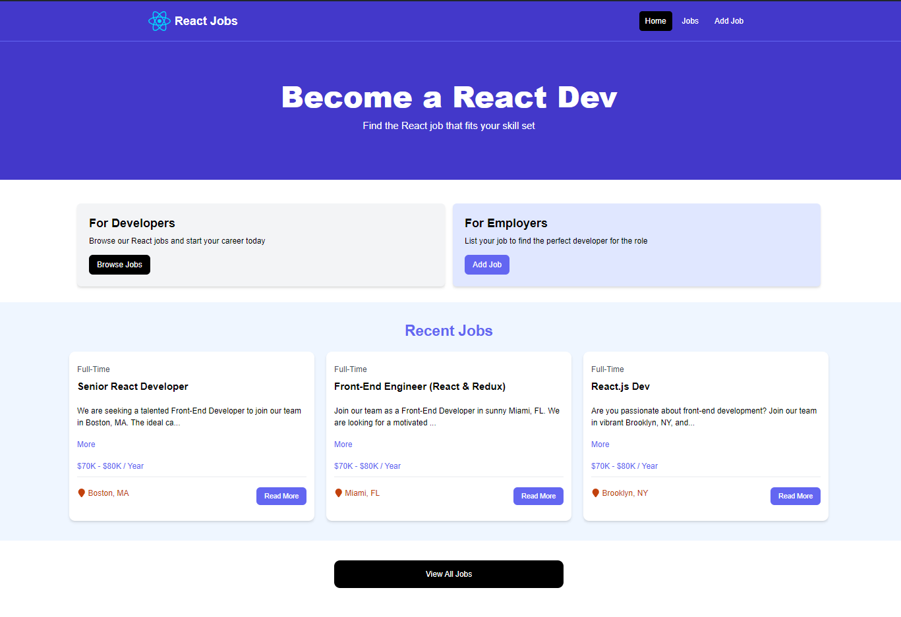

# React Job Portal



This project is a React-based job portal that allows users to view, add, and edit job listings. It uses TailwindCSS for styling, Redux for state management, and a JSON server for backend data handling.

## Features

- **View Job Listings:** Users can view a list of job openings.
- **Add Job Listings:** Users can add new job postings through a form interface.
- **Edit Job Listings:** Users can edit existing job postings.
- **Responsive Design:** The site is responsive and works on both mobile and desktop.

## Technologies Used

- **React** - For building the user interface.
- **Redux** - Used for managing state across the application.
- **Tailwind CSS** - For styling and building a responsive design.
- **JSON Server** - Acts as a backend to serve job data.
- **Vite** - Used as the build tool for better performance.

## Setup and Installation

```bash
    # Clone the repository
    git clone [your-repo-link]

    # Navigate to the project directory
    cd [your-project-directory]

    # Install dependencies
    npm install

    # Start the development server
    npm run dev

    # Start the JSON server on a new terminal
    npm run server
```
## Project Structure
- **src/** - Contains all the React components and Redux store configuration.
- **public/** - Contains static files like HTML and images.
- **index.css** - Global styles and Tailwind.css integration
- **vite.config.js** - Configuration for Vite.
- **tailwind.config.js** - Configuration for Tailwind CSS.


